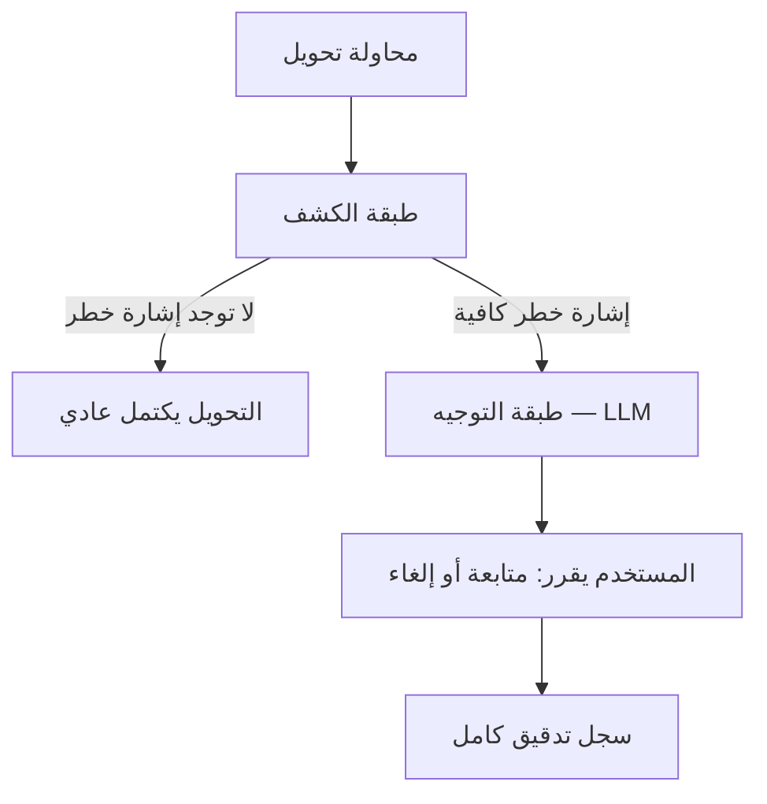

# 🛡️ Iraqi Scam Shield

**وكيل ذكاء اصطناعي لحماية مستخدمي المحافظ الإلكترونية العراقية من عمليات الاحتيال، عبر التدخل قبل إتمام التحويل وليس بعده.**

بُني هذا المشروع ضمن مسابقة **Agentic AI Challenge Iraq**، لمعالجة مشكلة حقيقية: مستخدمو المحافظ الإلكترونية بالعراق معرّضون لهندسة اجتماعية — وكلاء وهميون يطلبون رمز OTP، رسائل "فزت بجائزة" تطلب رسوم معالجة، وطلبات عاجلة لتحويل الأموال لـ"حساب آمن".

---

## 💡 الفكرة الأساسية

النظام مبني على **فصل صارم بين طبقتين**، وهذا الفصل مقصود وليس تفصيلاً تقنياً:



- **طبقة الكشف**: قواعد وعتبات صريحة، **بدون أي نموذج لغوي**. أي مراجع بشري يقدر يقرأها ويفهمها مباشرة.
- **طبقة التوجيه**: نموذج لغوي (Groq LLM) يتدخل فقط بعد ما القرار يصير، ودوره الشرح بالعراقي — **لا يتخذ القرار أبداً**.

هذا الفصل مبني على مبدأ أمني معياري: أي قرار حساس لازم يبقى **قابلاً للمراجعة البشرية (explainable)**، ودور النموذج اللغوي يقتصر على التواصل فقط.

---

## 🔍 طبقة الكشف — القواعد الخمس

القواعد مبنية على ثنائية معروفة بعالم الأمن السيبراني: **Signature-based detection** (مطابقة أنماط معروفة) مقابل **Behavioral/Anomaly-based detection** (كشف الانحراف عن سلوك المستخدم الطبيعي).

| القاعدة | الوصف | الفئة الأمنية |
|---|---|---|
| `RULE_01_ANOMALOUS_NEW_RECIPIENT` | تحويل كبير نسبياً لمستلم جديد | Behavioral baselining |
| `RULE_02_HIGH_VELOCITY` | سرعة تحويلات غير طبيعية لنفس الشخص خلال فترة قصيرة | Velocity control |
| `RULE_03_ABNORMAL_AMOUNT` | مبلغ أكبر من متوسط تحويلات هذا المستخدم بالتحديد | Behavioral baselining |
| `RULE_04_KNOWN_SCAM_FEE` | مبلغ أو كلمة تطابق كتالوج احتيال عراقي موثّق | Signature-based |
| `RULE_05_OFF_HOURS` | التحويل خارج الساعات المعتادة لهذا المستخدم بالتحديد | Behavioral baselining |

**ملاحظة تصميمية مهمة**: كل قاعدة تعتمد على **خط أساس شخصي لكل مستخدم** (`user baseline`) وليس عتبة ثابتة للجميع — هذا يقلل الإنذارات الكاذبة على معاملات شرعية (هدية، دفعة سنوية، مناوبة ليلية). القرار النهائي بالتدخل يُبنى على **تجميع نقاط القواعد المنطلقة مقابل عتبة محددة** — القيم الدقيقة موجودة بـ `risk_engine.py`.

---

## 💬 طبقة التوجيه

عند تجاوز العتبة، تُستدعى طبقة التوجيه (`coach_agent.py`) عبر **Groq API** لتوليد رسالة باللهجة العراقية تشرح:
- شنو الغلط بهذا التحويل بالتحديد
- شنو المحتال ممكن يسوي أو يقول بعدها
- خطوة واحدة آمنة وعملية

**آلية احتياط (fallback)**: لو النموذج اللغوي غير متاح، يظهر تحذير جاهز مسبقاً باللهجة العراقية بدل ما يفشل التنبيه بالكامل.

---

## 🗂️ هيكل المشروع

```
iraqi-scam-shield/
├── app.py                   # واجهة Streamlit الرئيسية
├── risk_engine.py           # طبقة الكشف — القواعد الخمس
├── coach_agent.py           # طبقة التوجيه — استدعاء Groq LLM
├── ai_coach.py               # وحدة مساعدة لتوليد التوجيه
├── groq_config.py           # إعدادات الاتصال بـ Groq API
├── data_generator.py        # توليد بيانات تركيبية بالذكاء الاصطناعي
├── dataset.json             # مجموعة اختبار ثابتة (25 مستخدم، ~300 معاملة)
├── scam_catalogue.json      # كتالوج أنماط احتيال عراقية موثقة
├── transactions.json        # بيانات تعريف المستخدمين
├── audit_log.json           # سجل تدقيق حي لكل تدخل ونتيجته
├── evaluate_model.py        # حساب الدقة والاستدعاء على مجموعة الاختبار
├── benchmark.py              # قياس الأداء
├── benchmark_results.json   # نتائج آخر تقييم
├── streamlit_dashboard.py   # لوحة عرض إضافية
├── main_api.py                # واجهة API
├── tests/
│   └── test_ai_coach.py
├── requirements.txt
└── .env.example              # نموذج متغيرات البيئة (بدون مفاتيح حقيقية)
```

---

## ⚙️ التشغيل المحلي

```bash
# 1. استنسخ المشروع
git clone https://github.com/YOUR_USERNAME/iraqi-scam-shield.git
cd iraqi-scam-shield

# 2. أنشئ بيئة افتراضية
python -m venv venv
source venv/bin/activate      # على ويندوز: venv\Scripts\activate

# 3. ثبّت المتطلبات
pip install -r requirements.txt

# 4. أعد تسمية .env.example إلى .env وضع مفتاح Groq API الخاص فيك
cp .env.example .env

# 5. شغّل الواجهة
streamlit run app.py
```

**متغيرات البيئة المطلوبة** (راجع `.env.example`):
```
GROQ_API_KEY=your_key_here
```

---

## 🧪 المنهجية والتقييم

- **بيانات تركيبية**: تاريخ معاملات لـ 25 مستخدم (~300 معاملة) مولّد بنموذج لغوي، مع سيناريوهات احتيال مزروعة عمداً (OTP، رسوم جوائز، حساب آمن).
- **فصل صارم بين بيانات التدريب والاختبار**: مجموعة الاختبار بـ `dataset.json` لم تُستخدم لضبط القواعد — هذا يحمي مصداقية نتائج التقييم.
- **كتالوج احتيال موثّق بحثياً**: أنماط احتيال عراقية حقيقية مجمّعة ومكتوبة بـ `scam_catalogue.json`، وليست مخترعة.
- شغّل `python evaluate_model.py` لحساب الدقة (precision) والاستدعاء (recall) على مجموعة الاختبار.

---

## ⚠️ مخاطر موثّقة وكيف عولجت

أثناء البناء، واجهنا وثّقنا ثلاث مشاكل حقيقية:

1. **فقدان حالة الجلسة بين التفاعلات** — كانت قاعدة التسلسل السريع لا تنطلق أبداً لأن حالة المستخدم كانت تُعاد من الصفر كل تفاعل بالواجهة. عولجت بحفظ الحالة بشكل دائم عبر `st.session_state` وتسجيل كل معاملة بخط الأساس فوراً.
2. **فشل صامت عند غياب مصدر البيانات** — لو ملف البيانات غير موجود بالمسار المتوقع، كان النظام يبدأ ببيانات فاضية بدون أي تحذير. عولجت بإضافة تحذير صريح عند الإقلاع.
3. **خطر تلوث مجموعة الاختبار** — فُصل بشكل صارم بين `dataset.json` (ثابت للتقييم) و `audit_log.json` (سجل حي للتشغيل) لحماية نزاهة القياس.

---

## 🧰 الأدوات والنماذج المستخدمة (إفصاح كامل)

| الأداة | الاستخدام |
|---|---|
| Python | محرك الكشف والمنطق الأساسي |
| Streamlit | واجهة العرض التفاعلية |
| FastAPI | واجهة API |
| Groq API | طبقة التوجيه — توليد الشرح باللهجة العراقية |
| بيانات تركيبية | مولّدة بنموذج لغوي، لا توجد بيانات عملاء حقيقية بالمشروع |

---

## 📌 سياق المشروع

بُني هذا المشروع كجزء من مسابقة **Agentic AI Challenge Iraq**، موضوع **Fraud & Scam Protection Agent**. التصميم ملتزم بشرط أساسي بالمسابقة: قرار الكشف يبقى دائماً قواعد صريحة قابلة للمراجعة البشرية، ودور النموذج اللغوي يقتصر على التوجيه والتواصل فقط.
